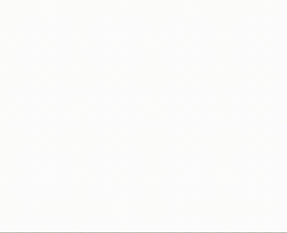
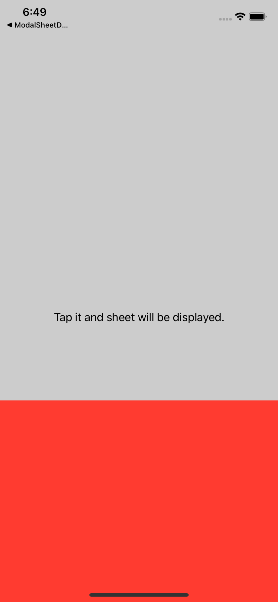
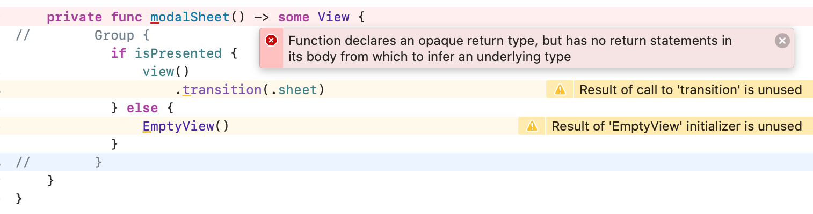
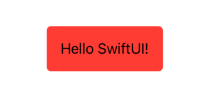

# NavigationDemo
This is a demo project trying to customize the transition animation with SwiftUI.


### MEMO
### Transition Animation
* [AnyTransition](https://developer.apple.com/documentation/swiftui/anytransition) has default animations.
  * [opacity](https://developer.apple.com/documentation/swiftui/anytransition/opacity)
  * [scale](https://developer.apple.com/documentation/swiftui/anytransition/scale)
  * [slide](https://developer.apple.com/documentation/swiftui/anytransition/slide)
  * [move](https://developer.apple.com/documentation/swiftui/anytransition/move(edge:))
  * [offset](https://developer.apple.com/documentation/swiftui/anytransition/offset(_:))
  * [scale](https://apple.co/34Iju3F)
* It is able to combine a AnyTransition with another AnyTransition.
```
Color.red
    .frame(width: 100, height: 100)
    .transition(
        AnyTransition.slide
            .combined(with: .scale(scale: 2))
    )
```

* It is also able to create custom transition with [GeometryEffect](https://developer.apple.com/documentation/swiftui/geometryeffect).<br>
`effectValue(size:)` method is called in each frame. <br>
`percentage` returns the current value of the effect.


```
struct SheetTransition {
    var percentage: CGFloat
}

extension SheetTransition: GeometryEffect {
    var animatableData: CGFloat {
        get { percentage }
        set { percentage = newValue }
    }

    func effectValue(size: CGSize) -> ProjectionTransform {
        let parcentage = percentage
        let ty = size.height*(1-parcentage)
        return ProjectionTransform(
            CGAffineTransform(a: 1, b: 0, c: 0, d: 1, tx: 0, ty: ty)
        )
    }
}
```
To use the transition above add extension on AnyTransition.
```
extension AnyTransition {
    static var sheet: AnyTransition {
        get {
            modifier(
                active: SheetTransition(percentage: 0), // Percentage at the start of display animation
                identity: SheetTransition(percentage: 1) // Percentage at start of hidden animation
            )
        }
    }
}
```

### Custom View Modifier
It is able to apply the same style to views with [ViewModifier](https://developer.apple.com/documentation/swiftui/viewmodifier).<br>
For Example, it can be used to present a Partial Modal Sheet.

<br>

Adopt the ViewModifier protocol to create a reusable modifier that can be apply to any view.<br>
Get the current body of the caller with `body(content:)` method.


```
struct ModalSheet<Destination>: ViewModifier where Destination: View {
    @Binding var isPresented: Bool

    var view: () -> Destination

    func body(content: Content) -> some View {
        ZStack {
            content
            background()
            modalSheet()
        }
    }

    private func background() -> some View {
      Color.black
          .opacity(isPresented ? 0.2 : 0)
          .ignoresSafeArea()
          .onTapGesture{
              withAnimation {
                  isPresented = false
              }
          }
    }

    private func modalSheet() -> some View {
        Group {
            if isPresented {
                view()
            } else {
                EmptyView()
            }
        }
    }
}
```
[Group](https://developer.apple.com/documentation/swiftui/group) acts as a transparent layout container. It can create a series of views inside a group, then wraps different view types.

<br>

Add extension on View that incorporates the view modifier.

```
extension View {
    func modalSheet<Destination: View>(
        isPresented: Binding<Bool>,
        view: @escaping () -> Destination
    ) -> some View {
        modifier(ModalSheet(isPresented: isPresented, view: view))
    }
}
```


### Get content size
Use `GeometryReader` inside of the view's `background(_:alignment:)`.
```
Text("Hello SwiftUI!")
        .padding()
        .background(
                GeometryReader { proxy in
                        // get size from proxy.size
                        Color.clear
                }
        )
```
Use `PreferenceKey` to share and update value obtained from `GeometryReader`.
```
struct ContentSizePreferenceKey: PreferenceKey {
    typealias Value = CGSize

    static var defaultValue: CGSize = .zero

    static func reduce(value: inout CGSize, nextValue: () -> CGSize) {
        value = nextValue()
    }
}
```
```
@State private var contentSize: CGSize = .zero
```
```
ZStack {
    RoundedRectangle(cornerRadius: 5)
        .fill(Color.red)
        .frame(width: contentSize.width, height: contentSize.height)
    Text("Hello SwiftUI!")
        .padding()
        .background(
            GeometryReader { proxy in
                Color.clear
                    .preference(key: ContentSizePreferenceKey.self, value: proxy.size)
            }
        )
}
.onPreferenceChange(ContentSizePreferenceKey.self) {
        contentSize = $0
}
```


I added `sizeThatFit()` method as extension of View to able to apply preceding process to any view.<br>
[View+SizeThatFit.swift](NavigationDemo/View+SizeThatFit.swift)
